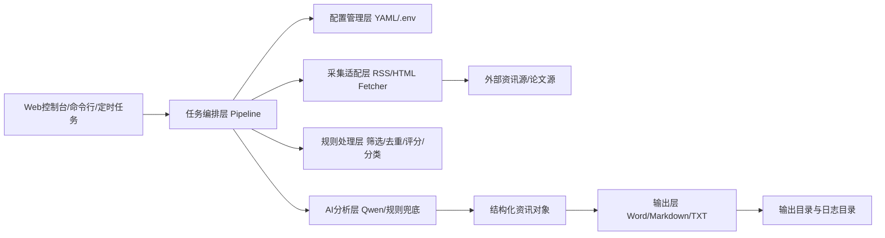
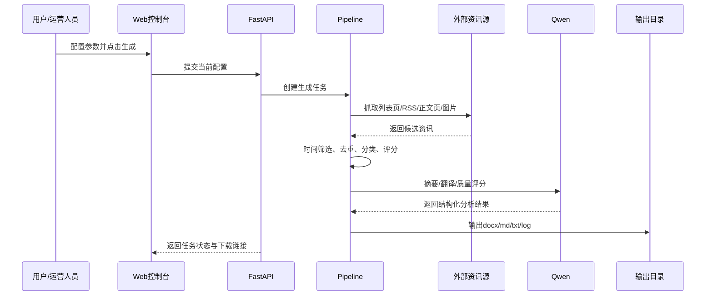
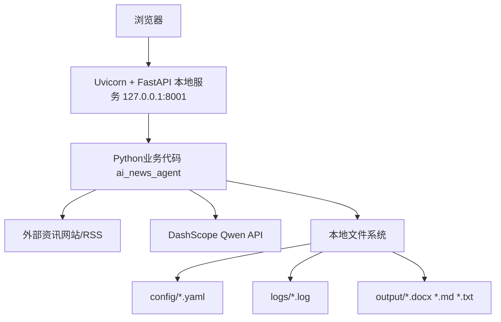

# 每日AI资讯生成智能体项目架构说明书

## 1. 项目概述

### 1.1 项目定位
“每日AI资讯生成智能体”是一个面向公司内部汇报、研究参考和管理决策场景的自动化情报生成系统。项目核心目标是围绕人工智能产业链，自动完成多源资讯抓取、质量筛选、去重分类、中文摘要生成、图文文档输出与可视化配置管理，形成可直接用于内部流转的 AI 日报。

### 1.2 核心目标
- 建立一套可持续运行的 AI 资讯采集与生成机制，替代人工逐站检索、复制、整理、汇编的低效流程。
- 形成标准化输出能力，稳定生成政府/央国企风格的 Word 日报、Markdown 备份和站点统计报告。
- 通过可视化配置界面，支持非研发人员按时间范围、数据源、抓取数量、摘要长度、质量阈值等参数自主调整运行策略。
- 为后续扩展到定时调度、专题周报、行业情报库、本地模型替换等能力预留架构空间。

### 1.3 应用场景
- 公司领导层获取每日 AI 行业动态、模型演进、产业落地和投融资信息。
- 投研、战略、创新、数字化团队跟踪国内外重点 AI 事件。
- 内部形成统一情报口径，减少多部门重复检索与重复整理。
- 后续可扩展为专题快报、周报、月报和专项研究材料的底层能力平台。

### 1.4 项目必要性与意义
- AI 行业信息变化快、站点分散、人工收集成本高，传统方式难以保证时效性和覆盖面。
- 各类信息存在重复转载、标题夸张、内容失真等问题，需要统一质量控制与结构化输出。
- 管理层更关注“可直接阅读和研判的材料”，而不是原始网页链接列表，因此必须具备自动摘要、分类和规范化成文能力。
- 项目采用轻量化架构，不依赖复杂基础设施，具备快速落地、低运维成本、可复制推广的优势。

## 2. 项目总体建设目标

本项目围绕“数据采集能力、内容理解能力、标准输出能力、配置运营能力”四条主线建设：

- 数据采集能力：对国内外 15 个 AI 资讯与论文来源进行统一采集，兼容 RSS 与 HTML 两类模式。
- 内容理解能力：结合规则引擎与 Qwen 大模型，实现中文摘要、英文转中文、分类、质量评分。
- 标准输出能力：输出政府/央国企内部材料风格的 `docx` 日报，并同步输出 `md` 与 `txt` 统计文件。
- 配置运营能力：通过 Web 控制台让用户调整运行参数，保存配置并一键生成结果。

## 3. 技术栈全景

### 3.1 技术栈总览
          本项目技术栈按类别整理如下，明确各技术栈的项目职责及解决的核心问题，排版整洁、逻辑清晰，可直接复制使用，适配汇报及文档归档场景。

          一、编程语言

          技术栈：Python 3.x

          项目职责：承担后端服务、采集管道、文档生成、调度脚本全部核心逻辑。

          解决核心问题：以较低成本实现爬取、文本处理、AI 调用和文件输出的一体化开发。

          二、前端相关

          1. 前端

          技术栈：HTML5 + CSS3 + 原生 JavaScript

          项目职责：实现本地 Web 可视化控制台、参数配置、进度展示、结果下载。

          解决核心问题：让非技术用户无需命令行即可操作系统。

          2. 前端模板

          技术栈：Jinja2

          项目职责：负责后端向前端页面注入初始配置、静态资源版本号等内容。

          解决核心问题：简化服务端渲染，避免引入重型前端框架。

          三、Web 服务相关

          1. Web 框架

          技术栈：FastAPI

          项目职责：提供配置查询、配置保存、任务创建、任务轮询、文件下载等接口。

          解决核心问题：以轻量方式快速构建本地 API 和页面服务。

          2. ASGI 服务

          技术栈：Uvicorn

          项目职责：承载 FastAPI 应用运行，提供本地 Web 服务。

          解决核心问题：支撑控制台访问与异步任务状态查询。

          四、内容采集与解析

          1. 内容抓取

          技术栈：Requests

          项目职责：对站点列表页、正文页、图片地址进行 HTTP 请求。

          解决核心问题：完成网页和图片的稳定抓取。

          2. HTML 解析

          技术栈：BeautifulSoup4

          项目职责：解析站点列表页、正文页标题、时间、正文、图片等内容。

          解决核心问题：将非结构化网页转为可处理的数据对象。

          3. RSS 解析

          技术栈：Feedparser

          项目职责：解析 RSS 源中的标题、发布时间、摘要和链接。

          解决核心问题：提升对标准资讯源与论文源的接入效率。

          4. 日期解析

          技术栈：python-dateutil

          项目职责：统一解析中英文时间格式、RSS 时间和站点文本时间。

          解决核心问题：解决不同站点发布时间格式不统一的问题。

          五、AI 相关

          1. AI 模型接入

          技术栈：DashScope SDK

          项目职责：调用阿里百炼 Qwen 模型进行摘要、翻译、分类、质量评分。

          解决核心问题：实现英文转中文、摘要提炼和语义判断。

          2. AI 模型

          技术栈：Qwen Turbo

          项目职责：提供中文摘要、分类判断、质量评分、关键信息抽取。

          解决核心问题：提高信息理解能力和成文质量。

          六、配置与环境管理

          1. 配置管理

          技术栈：PyYAML

          项目职责：读取默认配置、Web 保存配置、数据源配置。

          解决核心问题：将运行参数、数据源和样式规则外置，便于维护。

          2. 环境变量

          技术栈：python-dotenv

          项目职责：加载 `.env` 中的 DashScope API Key 等环境配置。

          解决核心问题：避免敏感信息硬编码在代码中。

          七、文档与图像处理

          1. 文档生成

          技术栈：python-docx

          项目职责：生成 Word 日报，控制标题、正文、表格、图片样式。

          解决核心问题：输出适合内部汇报流转的正式文档。

          2. 图像处理

          技术栈：Pillow

          项目职责：校验和处理下载图片。

          解决核心问题：保障文档插图兼容性与稳定性。

          八、任务调度与并发

          1. 定时调度

          技术栈：schedule

          项目职责：提供每日定时执行入口。

          解决核心问题：为后续自动生成日报预留调度能力。

          2. 并发执行

          技术栈：concurrent.futures 线程池

          项目职责：并行抓取站点正文、并行调用摘要分析。

          解决核心问题：降低整体运行时长，提升任务吞吐效率。

          九、存储与日志

          1. 本地存储

          技术栈：文件系统（YAML/LOG/DOCX/MD/TXT）

          项目职责：存放配置、日志、输出文档和统计结果。

          解决核心问题：在无数据库场景下实现轻量化落地。

          2. 日志能力

          技术栈：Python logging

          项目职责：记录采集数、筛选数、异常、生成结果。

          解决核心问题：支撑运行排错、站点监测和效果审计。

### 3.2 数据库与中间件说明

当前版本未引入独立数据库、消息队列、Redis、搜索引擎等中间件，属于“轻量化、单机可运行”的架构设计。

其设计原因如下：
- 当前核心目标是快速形成可运行、可配置、可汇报的日报生成能力。
- 项目数据以“任务运行态数据”和“输出型文档”为主，暂不需要复杂的历史检索和事务型存储。
- 使用本地 YAML 配置和文件输出即可满足当前阶段的业务需求，并降低部署与运维门槛。

后续若进入企业级平台化阶段，可平滑扩展：
- 数据库：保存历史资讯、生成记录、用户配置版本。
- Redis / 队列：支持任务排队、异步调度、并发控制。
- 对象存储：统一管理输出文档与图片资源。

## 4. 核心功能实现

### 4.1 多源资讯采集

系统当前接入 15 个国内外 AI 资讯与论文来源，覆盖：
- 国内 AI 媒体
- 国外 AI 媒体
- 聚合型资讯站
- AI 投融资资讯源
- 论文/研究源

实现逻辑：
- 对 RSS 源使用 `Feedparser` 直接读取条目。
- 对 HTML 源使用 `Requests + BeautifulSoup` 抓取列表页，按配置的选择器和规则提取文章链接。
- 对正文页继续抓取标题、发布时间、正文内容、图片链接。
- 通过配置项控制“同域抓取、外链抓取、跳过正文、强制分类、是否跟随全局抓取上限”等策略。

业务价值：
- 将分散站点统一纳入同一条生产链路。
- 对不同来源实施差异化抓取策略，兼顾覆盖率与稳定性。

### 4.2 时间范围筛选与初筛

系统支持两种时间策略：
- 固定起止日期
- 回退小时数

实现逻辑：
- 若配置了开始日期和结束日期，则按固定日期范围筛选。
- 若未配置日期范围，则按“当前时间向前回退 N 小时”筛选。
- 对发布时间缺失的资讯，系统会通过站点正文、时间选择器、列表卡片文本等多种方式做兜底识别。

业务价值：
- 满足每日例行日报和补历史日报两类典型场景。
- 保证输出信息具备时效性，避免陈旧内容混入日报。

### 4.3 去重与重要性排序

实现逻辑：
- 对标题标准化，结合 URL 去重。
- 当多篇文章重复时，优先保留来源权重更高、正文更完整、重要性分更高的版本。
- 重要性分综合来源权重、关键词命中、时效性、正文长度、栏目属性等多维因素计算。

业务价值：
- 避免多站转载同一新闻导致日报冗余。
- 让更重要、更权威、更完整的文章优先进入后续分析和成文。

### 4.4 摘要、翻译、分类与质量评分

实现逻辑：
- 默认接入 Qwen，通过 DashScope API 对文章执行：
  - 英文转中文
  - 中文摘要生成
  - 栏目分类
  - 质量评分
  - 投融资/论文辅助信息抽取
- 当 API 不可用时，系统自动退回规则模式，仍可完成摘要、分类和质量估计。
- 对 `forced_category` 来源，系统强制保留在指定栏目，避免模型误改分类。

业务价值：
- 将“原始资讯”转化为“可汇报内容”。
- 显著提升英文资讯的可用性，降低跨语言理解门槛。
- 通过质量评分提升日报整体信噪比。

### 4.5 栏目编排与文档生成

系统固定输出五大栏目：
- AI应用
- AI模型
- AI安全
- AI投融资
- 最新研究论文

实现逻辑：
- 按栏目归组后，依据重要性分和栏目入选上限进行编排。
- 输出 Word、Markdown 和站点统计 TXT 三类文件。
- Word 采用偏政府/央国企内部材料风格：
  - 标题规范
  - 栏目分节
  - 正文摘要
  - 配图插入
  - URL 附录
  - 投融资和论文表格输出

业务价值：
- 直接形成适合领导阅读和内部传阅的正式材料。
- 同时保留 Markdown 和统计文件，满足存档、复核和技术排查需求。

### 4.6 Web 控制台与配置运营

实现逻辑：
- 基于 FastAPI + Jinja2 + 原生 JS 实现本地控制台。
- 支持配置保存、默认恢复、参数修改、数据源增删启停、任务进度展示和结果下载。
- 前端实时轮询任务状态，展示当前阶段、进度条、抓取统计和本次任务实际生效配置。

业务价值：
- 降低系统使用门槛。
- 将研发配置能力转化为业务可操作能力。
- 便于不同使用者按场景自主调整策略。

### 4.7 运行监控与故障定位

实现逻辑：
- 输出日志文件，记录每个站点抓取数、筛后数、去重后数、最终入选数和异常信息。
- 额外生成站点统计 TXT 与页面统计表，用于直观看出失效源和弱源。

业务价值：
- 快速定位站点失效、筛选过严、来源质量下降等问题。
- 提高系统可维护性和持续运营能力。

## 5. 详细架构设计

### 5.1 逻辑架构

### 5.2 分层说明

#### 5.2.1 表现层
- Web 控制台
- 命令行入口
- 定时执行入口

职责：
- 接收用户配置
- 发起任务
- 展示进度与结果

#### 5.2.2 编排层
- `DailyNewsPipeline`

职责：
- 统一调度采集、筛选、分析、出文全流程
- 管理阶段进度、输出路径、结果对象

这是项目的核心控制中枢。

#### 5.2.3 采集适配层
- RSS 采集器
- HTML 采集器
- 正文抓取
- 图片抓取

职责：
- 屏蔽不同站点差异
- 按配置规则抽取统一结构化文章对象

#### 5.2.4 内容处理层
- 时间筛选
- AI 相关性初筛
- 去重
- 栏目分类
- 重要性评分
- 质量评分

职责：
- 将原始候选清洗为可进入日报的高价值内容

#### 5.2.5 AI 分析层
- Qwen 模型分析
- 规则模式回退

职责：
- 摘要生成
- 英文翻译
- 栏目识别
- 质量评估

#### 5.2.6 输出层
- Word 生成器
- Markdown 生成器
- 统计 TXT 输出器

职责：
- 将结构化内容转化为正式材料和监控结果

### 5.3 数据流向

### 5.4 部署架构

当前部署模式为“轻量单机部署”：

### 5.5 技术选型原因

| 模块 | 选型 | 原因 |
|---|---|---|
| Web 服务 | FastAPI | 轻量、开发快、接口定义清晰，适合本地控制台和异步任务接口 |
| 页面实现 | Jinja2 + 原生 JS | 当前页面规模适中，无需引入重型前端框架，部署简单 |
| AI 分析 | Qwen via DashScope | 中文能力强，适合摘要、翻译和内部汇报文风 |
| 配置存储 | YAML | 可读性好，便于业务人员和研发共同维护 |
| 输出文档 | python-docx | 适合直接生成可编辑、可流转的正式 Word 材料 |
| 任务调度 | schedule | 足够覆盖当前每日执行场景，部署成本低 |
| 存储方式 | 文件系统 | 当前阶段不需要重型数据库，轻量部署更适合试点与推广 |

## 6. 当前模块拆分与职责分工

| 模块/文件 | 职责说明 |
|---|---|
| `run_daily_news.py` | 命令行手动运行入口 |
| `run_web_ui.py` | 本地 Web 控制台启动入口 |
| `run_scheduler.py` | 定时运行入口 |
| `ai_news_agent/pipeline.py` | 全流程编排与进度控制 |
| `ai_news_agent/fetchers.py` | 多源抓取、正文补全、图片补全 |
| `ai_news_agent/filters.py` | 相关性筛选、去重、分类、重要性评分 |
| `ai_news_agent/llm.py` | Qwen 调用、摘要翻译、质量评分、规则回退 |
| `ai_news_agent/doc_generator.py` | Word 日报生成 |
| `ai_news_agent/markdown_generator.py` | Markdown 输出 |
| `ai_news_agent/stats_writer.py` | 站点统计 TXT 输出 |
| `ai_news_agent/config.py` | 默认配置、Web 配置、配置合并与路径归一化 |
| `web_ui/app.py` | Web 接口、页面服务、任务状态管理 |
| `web_ui/static/*` | 页面交互、样式、进度显示 |

## 7. 技术亮点与汇报重点补充

### 7.1 技术亮点一：多源异构采集与规则化适配

项目同时兼容 RSS、静态 HTML、聚合站外链和论文源，且通过配置驱动方式适配不同站点抓取规则。相比为每个站点单独写死逻辑，这种做法具备三项优势：
- 新增站点成本低
- 单站失效时影响范围可控
- 便于后续由研发和运营共同维护数据源

业务价值：
- 保证情报来源覆盖面和延展性
- 降低单一来源失效带来的业务风险

### 7.2 技术亮点二：规则引擎与大模型双轨协同

项目不是单纯依赖大模型，也不是纯规则系统，而是采用“双轨协同”：
- 规则层负责筛选、去重、基础分类、重要性排序和兜底保障
- Qwen 负责摘要、翻译、质量判断和语义增强

这样可以在 API 可用时获得更高内容质量，在 API 不可用时仍保持系统可运行。

业务价值：
- 提高系统稳定性和连续服务能力
- 避免模型不可用时整条生产链路中断

### 7.3 技术亮点三：轻量部署但具备平台化扩展潜力

当前架构不依赖数据库和复杂中间件，单机即可运行；同时各能力模块已经清晰解耦，后续可平滑扩展为企业级平台：
- 接入数据库保存历史资讯库
- 接入任务队列支持并发调度
- 接入对象存储与权限体系
- 替换为本地模型或混合模型策略

业务价值：
- 当前阶段部署成本低、试点推进快
- 中长期具备向“企业级 AI 情报平台”演进的空间

## 8. 项目业务价值总结

从业务视角看，本项目已经不只是“自动爬虫”，而是一个轻量可落地的 AI 情报生产系统，核心价值包括：

- 提升时效性：缩短从资讯发生到内部材料成文的时间。
- 提升覆盖面：统一纳入国内外 AI 媒体、投融资、论文来源。
- 提升标准化：将零散网页信息转化为统一风格的正式文档。
- 提升决策支撑能力：让领导层更快抓住 AI 产业、技术和资本的重要变化。
- 降低人工成本：减少人工搜索、复制、编写和排版工作量。
- 提升可持续运营能力：通过 Web 配置、统计报表和日志体系支持长期运行。

## 9. 后续演进建议

为进一步提升系统能力，建议分阶段推进：

### 第一阶段：稳定性增强
- 扩展更多稳定的投融资与论文来源
- 持续优化弱站点适配
- 增加异常告警与站点健康监控

### 第二阶段：平台化增强
- 引入数据库保存历史资讯与生成记录
- 支持按主题、部门、日期回溯查询
- 增加用户角色与多套模板管理

### 第三阶段：智能化增强
- 接入本地模型或混合模型体系
- 增加专题追踪、趋势分析、竞品跟踪能力
- 从“日报生成”扩展到“专题研究底座”

## 10. 结论

“每日AI资讯生成智能体”项目已经形成从多源采集、智能分析到正式成文的完整闭环，具备以下特征：
- 架构清晰
- 轻量可部署
- 业务价值明确
- 可配置、可维护、可扩展

